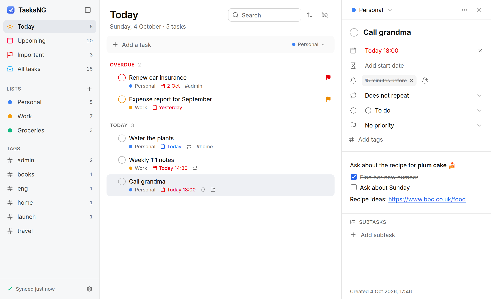
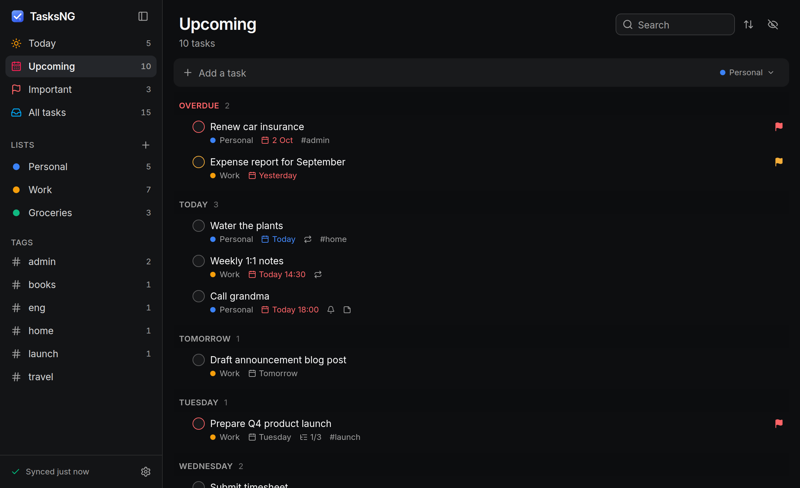
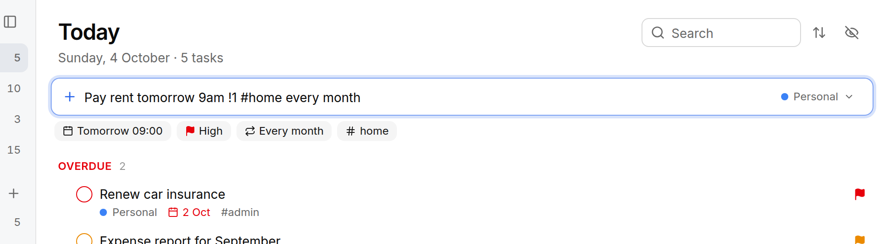

<div align="center">


# TasksNG

A keyboard-friendly task manager for your [Baikal](https://sabre.io/baikal/) server and other
CalDAV servers built on sabre/dav. Runs on Windows 10 and 11 and on Linux, with a package for NixOS.

[](https://github.com/sshahs/tasksng/actions/workflows/build.yml)
[](https://github.com/sshahs/tasksng/releases/latest)
[](#nixos-and-nix)

[](https://v2.tauri.app/)

[Install](#install) · [Features](#features) · [Shortcuts](#keyboard-shortcuts) ·
[Linux notes](#running-on-linux) · [How it works](#how-it-works) · [Development](#development)



</div>

Every change you make lands in a local cache first and syncs in the background, so the window
never waits for the network. TasksNG opens from that cache in milliseconds, keeps working
offline, and sends queued changes once the server is reachable again.

It is a [Tauri 2](https://v2.tauri.app/) app with a React and [shadcn/ui](https://ui.shadcn.com)
interface. The Windows installer is a few MB and uses the WebView2 runtime that comes with
Windows; on Linux it runs on WebKitGTK. Light and dark themes follow your system.

Tasks are stored as standard iCalendar `VTODO`s, so Thunderbird, Apple Reminders, Tasks.org and
DAVx⁵ can work on the same lists. When you edit a task, TasksNG keeps the properties other apps
wrote, and it uses ETags so it never silently overwrites a change made on another device.

<p align="center">
  
</p>

## Install

### Windows

Download the installer from the [latest release](https://github.com/sshahs/tasksng/releases/latest):

| File | What it is |
| --- | --- |
| `TasksNG_x.y.z_x64-setup.exe` | Per-user installer. Needs no admin rights and is the one most people want. |
| `TasksNG_x.y.z_x64_en-GB.msi` | Per-machine installer for managed deployments, in British English. |
| `TasksNG-portable.exe` | A single executable with no installation. It needs WebView2, which Windows 11 and up-to-date Windows 10 include, and it doesn't update itself. |

Builds of every commit are on the [Actions](https://github.com/sshahs/tasksng/actions) tab as the
`TasksNG-windows-x64` artifact.

### NixOS and Nix

The repository is a flake. It has the package for `x86_64-linux` and `aarch64-linux`, a NixOS
module, an overlay and a development shell. To try TasksNG without installing it:

```sh
nix run github:sshahs/tasksng
```

To install it with the NixOS module:

```nix
# flake.nix
{
  inputs.tasksng.url = "github:sshahs/tasksng";
  # Optional: build against your nixpkgs instead of the one CI tests with.
  # inputs.tasksng.inputs.nixpkgs.follows = "nixpkgs";

  outputs = { nixpkgs, tasksng, ... }: {
    nixosConfigurations.my-pc = nixpkgs.lib.nixosSystem {
      modules = [
        tasksng.nixosModules.default
        {
          programs.tasksng.enable = true;
          # programs.tasksng.autostart = true; # start in the background at login, for everyone
          # programs.tasksng.keyring = true;   # GNOME Keyring for window managers (Sway, Hyprland, i3 …)
        }
      ];
    };
  };
}
```

You can also add `tasksng.packages.${pkgs.system}.default` to `environment.systemPackages` or Home
Manager's `home.packages` yourself, or apply `tasksng.overlays.default` to get `pkgs.tasksng`.
`nix profile install github:sshahs/tasksng` works too. Without flakes, import `nix/module.nix`
from a checkout, or call `nix/package.nix` with `callPackage`.

Nix installs update with the rest of your system: run `nix flake update tasksng` and then
`nixos-rebuild switch` (or `home-manager switch`, or `nix profile upgrade`). The new version
starts the next time you start TasksNG, so quit the running copy from the tray menu or with
<kbd>Ctrl</kbd>+<kbd>Q</kbd>. See [Running on Linux](#running-on-linux) for keyrings, trays,
notifications and Wayland.

### Connecting to Baikal

On first start, enter your Baikal address (for example `https://dav.example.com`), your username
and your password. TasksNG finds your task lists through `/.well-known/caldav` or `/dav.php`. If
Baikal lives in a sub folder, enter the full URL ending in `dav.php`, such as
`https://example.com/baikal/html/dav.php`.

TasksNG doesn't show calendars that only allow events. Baikal sets a calendar's components in
the admin panel under *Users and resources → Calendars*. Lists you create from TasksNG are
task-only calendars.

## Features

### Lists and views

The sidebar has four smart lists. *Today* includes overdue tasks and tasks that start today,
*Upcoming* groups tasks by day, and there are *Important* and *All tasks*. Below them are your
Baikal calendars that hold tasks, which you can create, rename, recolour and delete from
TasksNG. Tags and saved searches appear underneath (see [Search filters](#search-filters)).

Each list can be sorted by due date, priority, title or creation date, or by hand. Drag a task
to reorder it, drop it on another task to make it a subtask, on a list to move it there, or on
*Today*, *Important* or a tag to set that.

### Quick add

Type a task the way you'd say it and TasksNG picks out the details as you type:

<p align="center">
  
</p>

| You type | It sets |
| --- | --- |
| `today`, `tomorrow`, `fri`, `next week`, `in 3 days`, `2026-12-01` | Due date |
| `9am`, `17:30` | Due time |
| `from fri`, `starting next week` | Start date |
| `!1` `!2` `!3`, or `!!!`, `!high` | Priority |
| `#tag` | Tag |
| `@name` | List |
| `daily`, `weekdays`, `every 2 weeks`, `every tue and thu`, `every 15th`, `every last friday`, `every 3 days after completion` | Repeat rule |

Quick add also works from anywhere. <kbd>Win</kbd>+<kbd>Alt</kbd>+<kbd>N</kbd> (you can change
it) opens a small box on top of whatever you're doing. On Wayland you bind the shortcut in your
desktop's settings instead; see [Running on Linux](#running-on-linux).

### Tasks

A task can have a due date and a start date. Tasks that start later stay out of *Today* until
their start date. Tasks also have a priority, a status (to do, in progress, done or cancelled),
tags, notes and subtasks.

Repeating tasks can repeat every few days, weeks, months or years, on chosen weekdays, on a day
of the month or on "the last Friday". A series can stop after a number of times or on a date,
and the next date can count from when you completed the task. Completing a repeating task moves
it to the next date, and cancelling it skips one.

Notes support Markdown: bold, italics, lists, links you can click and `- [ ]` checklists you can
tick. You can also move tasks between lists, duplicate them, and delete them with undo.

### Reminders and the tray

Reminders show up as system notifications with *Snooze* and *Done* buttons. They are standard
iCalendar alarms (`VALARM`), so a reminder set in Thunderbird, on an iPhone or in Tasks.org works
here and the other way round. Tasks with a due time and no reminder of their own get an automatic
one at the due time. You can change that offset or turn it off in Settings. It stays on this
computer and isn't written to the server.

TasksNG has to run for reminders to appear, so closing the window keeps it in the notification
area by default. Right-click the icon to quit. Settings can make closing quit the app instead,
and can start TasksNG when you sign in. It then starts quietly in the background.

Reminders missed while TasksNG wasn't running appear when it starts, as long as they are less
than a day old. Which reminders were shown, and any snoozes, are remembered on this computer
only. If notifications don't appear on Windows, check *Settings → System → Notifications* and
Focus. *Settings → Send a test notification* in TasksNG shows a sample.

### Sync

TasksNG syncs in the background on a schedule you choose, when the window gets focus and when
the network comes back. It supports Basic and Digest authentication (Digest is Baikal's
default). Your password goes into Windows Credential Manager or, on Linux, into your desktop's
keyring. TasksNG trusts the certificates your system trusts, and has an option to accept
self-signed ones.

### Keyboard shortcuts

Everything works from the keyboard, and the command palette
(<kbd>Ctrl</kbd>+<kbd>K</kbd>) jumps to any task, list, tag or saved search.

| Keys | Action |
| --- | --- |
| <kbd>Win</kbd>+<kbd>Alt</kbd>+<kbd>N</kbd> | Quick add from anywhere (configurable; <kbd>Super</kbd> on Linux) |
| <kbd>N</kbd> or <kbd>Ctrl</kbd>+<kbd>N</kbd> | New task |
| <kbd>Ctrl</kbd>+<kbd>K</kbd> | Command palette |
| <kbd>Ctrl</kbd>+<kbd>F</kbd> or <kbd>/</kbd> | Search |
| <kbd>↑</kbd> <kbd>↓</kbd> or <kbd>J</kbd> <kbd>K</kbd> | Move the selection |
| <kbd>Space</kbd> | Complete or reopen |
| <kbd>I</kbd> | Mark as in progress |
| <kbd>Alt</kbd>+<kbd>↑</kbd> <kbd>↓</kbd> | Move the task up or down (manual order) |
| <kbd>Alt</kbd>+<kbd>→</kbd> <kbd>←</kbd> | Make it a subtask of the task above, or move it back out |
| <kbd>Enter</kbd> or <kbd>F2</kbd> | Edit the title |
| <kbd>1</kbd> <kbd>2</kbd> <kbd>3</kbd> <kbd>0</kbd> | High, medium, low or no priority |
| <kbd>T</kbd> or <kbd>M</kbd> | Due today or tomorrow |
| <kbd>Del</kbd> | Delete (with undo) |
| <kbd>Ctrl</kbd>+<kbd>Z</kbd> | Undo the delete |
| <kbd>Ctrl</kbd>+<kbd>H</kbd> | Show or hide completed tasks |
| <kbd>Ctrl</kbd>+<kbd>1</kbd>…<kbd>9</kbd> | Switch list |
| <kbd>Ctrl</kbd>+<kbd>B</kbd> | Toggle the sidebar |
| <kbd>F5</kbd> | Sync now |
| <kbd>Ctrl</kbd>+<kbd>Q</kbd> | Quit TasksNG |

### Search filters

The search box and saved searches understand filters. Put `-` in front of a filter to exclude
what it matches.

| Filter | Finds |
| --- | --- |
| `milk` | Tasks with "milk" in the title, notes or tags |
| `#home` | Tasks tagged *home* |
| `!1` `!2` `!3` | High, medium or low priority |
| `list:Work`, `list:"Big project"` | Tasks in a list |
| `due:today` `due:tomorrow` `due:overdue` `due:week` `due:none` `due:2026-12-01` | Tasks by due date |
| `is:open` `is:done` `is:progress` `is:cancelled` `is:repeating` `is:reminder` `is:subtask` `is:later` | Tasks by state |

For example, `#work !1 -is:progress due:week` finds high-priority work tasks due this week that
aren't in progress yet. Click the bookmark next to the search box to keep a search in the sidebar.

## Running on Linux

TasksNG stores your password in your desktop's keyring through the Secret Service API, which
GNOME Keyring, KWallet and KeePassXC provide. On a bare window manager with no keyring, it
keeps the password in a file only you can read
(`~/.local/share/app.tasksng.desktop/credentials.json`) and moves it into the keyring once one
is running. With the NixOS module, `programs.tasksng.keyring = true` turns on GNOME Keyring.

Reminders work with any freedesktop notification server, including GNOME, KDE, dunst, mako and
swaync. The *Snooze* and *Done* buttons appear where the server supports buttons.

The tray icon shows up wherever StatusNotifierItem or AppIndicator icons do, which covers KDE,
Waybar and most panels. GNOME needs the *AppIndicator and KStatusNotifierItem Support*
extension. Without a tray, closing the window still keeps TasksNG running for reminders. Open
it again from your app launcher, and quit with <kbd>Ctrl</kbd>+<kbd>Q</kbd> or *Quit TasksNG*
in the command palette. You can also turn off *Keep running in the background* in Settings.

The global quick add shortcut works on X11. Wayland doesn't let apps grab keys, so bind a
shortcut in your desktop's keyboard settings to `tasksng --quick-add`:

```sh
# Sway
bindsym $mod+Alt+n exec tasksng --quick-add
# Hyprland
bind = SUPER ALT, N, exec, tasksng --quick-add
```

Tiling window managers should float the quick add box:

```sh
# Sway, i3
for_window [title="^Quick add · TasksNG$"] floating enable
# Hyprland
windowrulev2 = float, title:^(Quick add · TasksNG)$
```

*Start TasksNG when you log in* (Settings) writes `~/.config/autostart/TasksNG.desktop`. It runs
`tasksng --hidden` from your profile rather than a Nix store path, so it keeps working after
updates and garbage collection.

For a self-signed server certificate, add your CA with `security.pki.certificateFiles` instead
of turning on *Accept invalid TLS certificates*.

TasksNG also has a small command line. While it runs, these flags act on the running copy:

```text
tasksng --quick-add   open the quick add box
tasksng --show        show the main window
tasksng --sync        sync now
tasksng --quit        quit TasksNG
tasksng --hidden      start in the background (used at login)
tasksng --version     print the version
```

## Updates

Installed Windows copies update themselves. They download new releases in the background, check
them against the app's signing key and install them after a restart. *Settings → Updates* shows
the state and lets you check by hand. The portable exe doesn't update, so download a new copy to
upgrade it. Nix installs update through Nix, as described in [NixOS and Nix](#nixos-and-nix).

## How it works

```
┌──────────── WebView2 / WebKitGTK ────────────┐      ┌──────────── Rust ─────────────┐
│ React + shadcn/ui                            │ IPC  │ tauri commands, tray, toasts  │
│ zustand store (optimistic updates)           │◄────►│ tasks-core                    │
└──────────────────────────────────────────────┘      │  ├ store.rs  local cache (JSON)│
                                                      │  ├ sync.rs   push → pull       │
                                                      │  ├ dav/      CalDAV client     │
                                                      │  ├ ical.rs   lossless iCal     │
                                                      │  ├ model.rs  VTODO ⇄ Task      │
                                                      │  ├ recur.rs  repeat rules      │
                                                      │  └ alarms.rs reminders due     │
                                                      └───────────────┬───────────────┘
                                                                      │ HTTPS (WebDAV)
                                                                 Baikal server
```

A local edit updates the cache immediately and is marked as pending. About 300 ms later
TasksNG pushes it to the server with `PUT` (using `If-Match` or `If-None-Match`) or `DELETE`
(using `If-Match`).

A sync first pushes pending changes and then checks each list's `getctag`. Only lists whose
ctag changed are listed (`calendar-query` for ETags), and only changed tasks are downloaded
(`calendar-multiget`). If a task changed on another device in the meantime, TasksNG keeps the
server's version and shows a notice.

Manual order is stored in `X-APPLE-SORT-ORDER`, as Apple Reminders and Tasks.org do. iCalendar
has no field for "repeat after completion", so TasksNG uses `X-TASKSNG-REPEAT-FROM`.

## Development

You need Node 22 or later and stable Rust. Windows builds also need the
[Tauri prerequisites](https://v2.tauri.app/start/prerequisites/) (the MSVC build tools and
WebView2). On NixOS, `nix develop` provides everything; see [Nix](#nix) below.

```sh
npm install
npm run app:dev      # run the desktop app with hot reload
npm run app:build    # build installers (target/release/bundle)
```

`npm run dev` serves the UI in a normal browser with an in-memory demo backend, which is
handy when you only work on the UI. Add `?setup` to the URL to see the sign-in screen; the demo
password is `demo`. The screenshots in this README come from that demo.

### Tests

```sh
npm test                     # UI logic (quick add, views, search, sorting, drag and drop, Markdown, repeat rules)
cargo test -p tasks-core     # iCalendar, recurrence, reminders, store, auth unit tests
cargo test -p tasksng        # notification payloads, command line, password file (needs the Tauri build dependencies)

# End-to-end against a real sabre/dav server configured exactly like Baikal:
cd tools/baikal-dev-server && composer install
php -S 127.0.0.1:8800 router.php &                    # Digest auth (Baikal default)
BAIKAL_AUTH=Basic php -S 127.0.0.1:8801 router.php &  # Basic auth
cd ../..
TASKSNG_TEST_URL=http://127.0.0.1:8800 cargo test -p tasks-core --test baikal -- --test-threads=1
TASKSNG_TEST_URL=http://127.0.0.1:8801 cargo test -p tasks-core --test baikal -- --test-threads=1
```

CI (`.github/workflows/build.yml`) runs all of these on every push. It also runs clippy on the
Linux app, builds the Windows installers on `windows-latest`, and builds the Nix package and
checks the NixOS module.

### Nix

`nix develop` opens a shell with Rust, Node, the GTK and WebKit libraries, `cargo tauri`, and PHP
for the Baikal test server. `npm install && npm run app:dev` then runs the app. `nix build`
builds the package into `./result/bin/tasksng`, `nix flake check` also checks the NixOS module,
and `nix fmt` formats the Nix files.

The package reads its version from `src-tauri/tauri.conf.json`. It needs no hashes, because it
takes the Rust crates and npm packages straight from `Cargo.lock` and `package-lock.json`, so
dependency updates need no change to the Nix files.

### Releases

Before the first release, add the updater signing key as a repository secret named
`TAURI_SIGNING_PRIVATE_KEY` (*Settings → Secrets and variables → Actions*). If the key has a
password, add `TAURI_SIGNING_PRIVATE_KEY_PASSWORD` as well. Keep a backup of the key, because
installed copies only accept updates signed with it.

For each release, first set the new version in `src-tauri/tauri.conf.json`, `package.json`
(`npm version X.Y.Z --no-git-tag-version`) and the workspace `Cargo.toml`, and commit it. The
Nix package reads its version from the repository, while CI stamps it into the Windows builds.

Then run the *Build* workflow from the *Actions* tab (*Run workflow*, with a version such as
`0.3.0`), or push a tag:

```sh
git tag v0.3.0
git push origin v0.3.0
```

CI builds the installers with that version, signs them, generates `latest.json` with
`scripts/updater-manifest.mjs`, and publishes everything as a GitHub release. Installed copies
pick it up on their next check. Versions must be plain `X.Y.Z`, because the MSI format doesn't
allow pre-release suffixes.

To switch to a different signing key, run `npx tauri signer generate -w tasksng.key`, put the
contents of `tasksng.key.pub` into `plugins.updater.pubkey`, and store `tasksng.key` in the
secret. Copies installed before the switch only accept updates signed with the old key, so
they need one update by hand.

### Project layout

```
crates/tasks-core/      platform independent sync engine (Rust)
src-tauri/              desktop shell: commands, background sync, credential storage, tray, notifications
src/                    React UI
  components/ui/        shadcn/ui components
  components/           app components (sidebar, task list, details, dialogs)
  lib/                  store, API bindings, date & quick-add parsing, view logic
nix/                    Nix package and NixOS module (flake.nix at the root)
tools/baikal-dev-server Baikal-equivalent CalDAV server for development and tests
scripts/                release helpers used by CI (version stamping, updater manifest)
docs/screenshots/       images used in this README
```

### Where data lives

| | Windows | Linux |
| --- | --- | --- |
| Tasks and pending changes (`tasks-cache.json`), `settings.json`, `reminders.json` | `%APPDATA%\app.tasksng.desktop\` | `~/.local/share/app.tasksng.desktop/` |
| Logs | `%LOCALAPPDATA%\app.tasksng.desktop\logs\` | `~/.local/share/app.tasksng.desktop/logs/` |

Saved searches, sort orders and view preferences live in the app's web storage.
